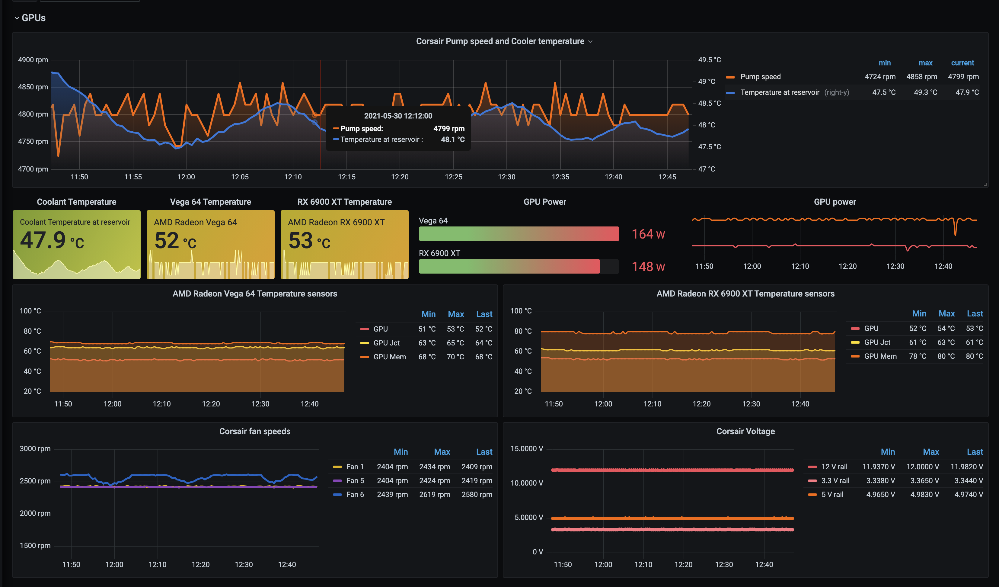

# liquidctl [Prometheus][2] exporter

Collects metrics from [liquidctl][1] supported devices and presents them for scraping


Example [Grafana][4] dashboard



## Usage

### Requirenments:
- [liquidctl][1] is installed with support of JSON output (v1.6.x+)
- Golang if building on the same system  

### Build and installation on Linux:
```shell
# Clone the repository
git clone https://github.com/paha/liquidctl-exporter
cd liquidctl-exporter
# Build
go build ./liquidctl-exporter.go
# Install
sudo cp ./liquidctl-exporter /usr/local/bin
# Setup systemd service
sudo cat << SERVICE > /etc/systemd/system/liquidctl-exporter.service
[Unit]
Description=Liquidctl prometheus exporter
[Service]
ExecStart=/usr/local/bin/liquidctl-exporter
[Install]
WantedBy=default.target
SERVICE
systemctl daemon-reload
systemctl enable liquidctl-exporter
systemctl start liquidctl-exporter
```

### Validation

```shell
# service status
systemctl status liquidctl-exporter
# service logs
journalctl -u liquidctl-exporter
# Preview exposed metrics
curl http://localhost:9530/metrics | grep liquidctl
```

### Configuration
Prometheus exporter _port_, update _interval_ and _path_ to `liquidctl` can be set via environment variables:

| Variable    | Description | Default       |
| :---        |    :----   |          ---: |
| `LIQUIDCTL_EXPORTER_PORT` | Exporter port. RE: [port allocations][3] | 9530 |
| `LIQUIDCTL_EXPORTER_INTERVAL` | Update interval | 10 seconds |
| `LIQUIDCTL_EXPORTER_PATH` | Path to `liquidctl` | `/usr/local/bin/liquidctl` |

### Windows and MacOS support

Should work on Windows and MacOS as long as the proper path to the liquidctl excutable is set. _Not tested on either Windows or Mac however._

---
### TODO

- better metrics naming and labeling
- Containerized builds and delivery
- Releases, CI, container images hosting
- test on Windows and MacOS
---

### Docker container

The repository also contains a Dockerfile for building a container image. The image is not yet published to a registry, but can be built locally using the following docker compose file:

```shell
version: "3.8"

services:
  liquidctl-exporter:
    build:
      context: ./exporters/liquidctl-exporter
    image: liquidctl-exporter
    container_name: liquidctl-exporter
    ports:
      - "9530:9530"
    privileged: true
    restart: unless-stopped
    network_mode: host
```

> [!NOTE]\
> The container needs to be run in privileged mode to be able to access the USB devices.

## Examples

Metrics exposed with a single Corsair Commander Pro device:

```shell
# HELP liquidctl_hidraw0_12_volt_rail Corsair Commander Pro 12 volt rail (V).
# TYPE liquidctl_hidraw0_12_volt_rail gauge
liquidctl_hidraw0_12_volt_rail 11.991
# HELP liquidctl_hidraw0_33_volt_rail Corsair Commander Pro 3.3 volt rail (V).
# TYPE liquidctl_hidraw0_33_volt_rail gauge
liquidctl_hidraw0_33_volt_rail 3.341
# HELP liquidctl_hidraw0_5_volt_rail Corsair Commander Pro 5 volt rail (V).
# TYPE liquidctl_hidraw0_5_volt_rail gauge
liquidctl_hidraw0_5_volt_rail 4.968
# HELP liquidctl_hidraw0_fan_1_speed Corsair Commander Pro Fan 1 speed (rpm).
# TYPE liquidctl_hidraw0_fan_1_speed gauge
liquidctl_hidraw0_fan_1_speed 2419
# HELP liquidctl_hidraw0_fan_2_speed Corsair Commander Pro Fan 2 speed (rpm).
# TYPE liquidctl_hidraw0_fan_2_speed gauge
liquidctl_hidraw0_fan_2_speed 0
# HELP liquidctl_hidraw0_fan_3_speed Corsair Commander Pro Fan 3 speed (rpm).
# TYPE liquidctl_hidraw0_fan_3_speed gauge
liquidctl_hidraw0_fan_3_speed 4819
# HELP liquidctl_hidraw0_fan_4_speed Corsair Commander Pro Fan 4 speed (rpm).
# TYPE liquidctl_hidraw0_fan_4_speed gauge
liquidctl_hidraw0_fan_4_speed 0
# HELP liquidctl_hidraw0_fan_5_speed Corsair Commander Pro Fan 5 speed (rpm).
# TYPE liquidctl_hidraw0_fan_5_speed gauge
liquidctl_hidraw0_fan_5_speed 2419
# HELP liquidctl_hidraw0_fan_6_speed Corsair Commander Pro Fan 6 speed (rpm).
# TYPE liquidctl_hidraw0_fan_6_speed gauge
liquidctl_hidraw0_fan_6_speed 2580
# HELP liquidctl_hidraw0_temp_sensor_1 Corsair Commander Pro Temp sensor 1 (°C).
# TYPE liquidctl_hidraw0_temp_sensor_1 gauge
liquidctl_hidraw0_temp_sensor_1 47.94
# HELP liquidctl_hidraw0_temp_sensor_2 Corsair Commander Pro Temp sensor 2 (°C).
# TYPE liquidctl_hidraw0_temp_sensor_2 gauge
liquidctl_hidraw0_temp_sensor_2 0
# HELP liquidctl_hidraw0_temp_sensor_3 Corsair Commander Pro Temp sensor 3 (°C).
# TYPE liquidctl_hidraw0_temp_sensor_3 gauge
liquidctl_hidraw0_temp_sensor_3 0
# HELP liquidctl_hidraw0_temp_sensor_4 Corsair Commander Pro Temp sensor 4 (°C).
# TYPE liquidctl_hidraw0_temp_sensor_4 gauge
liquidctl_hidraw0_temp_sensor_4 0
```

---

[1]: https://github.com/liquidctl/liquidctl
[2]: https://prometheus.io/
[3]: https://github.com/prometheus/prometheus/wiki/Default-port-allocations
[4]: https://grafana.com/
